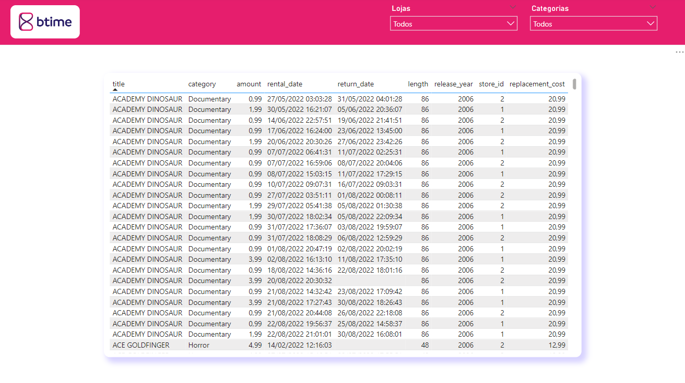

# Btime Technical Test
### Índice

- [Btime Technical Test](#btime-technical-test)
    - [Índice](#índice)
    - [Contextualização:](#contextualização)
    - [Metodologia Aplicada:](#metodologia-aplicada)
  - [Entendimento do Negócio:](#entendimento-do-negócio)
  - [Entendimento dos Dados:](#entendimento-dos-dados)
    - [Schemas:](#schemas)
    - [Consulta SQL:](#consulta-sql)
    - [Variáveis:](#variáveis)
    - [Verificando as Dimensões do DataFrame:](#verificando-as-dimensões-do-dataframe)
    - [Describe:](#describe)
    - [Verificando Valores Nulos:](#verificando-valores-nulos)
    - [Verificando Tipos:](#verificando-tipos)
  - [Estudo sobre Os Aluguéis de Filmes em nossa base de dados (2022):](#estudo-sobre-os-aluguéis-de-filmes-em-nossa-base-de-dados-2022)
    - [Qual é a distribuição da duração dos aluguéis?](#qual-é-a-distribuição-da-duração-dos-aluguéis)
    - [Qual foi a tendência mensal no número de aluguéis ao longo do tempo?](#qual-foi-a-tendência-mensal-no-número-de-aluguéis-ao-longo-do-tempo)
  - [Power BI:](#power-bi)
    - [Consulta SQL:](#consulta-sql-1)
    - [Variáveis:](#variáveis-1)
    - [Menu:](#menu)
    - [Geral:](#geral)
    - [Alugueis:](#alugueis)
    - [Tabela Dinâmica:](#tabela-dinâmica)
  - [Preparação dos Dados:](#preparação-dos-dados)
  - [Modelagem:](#modelagem)
  - [Avaliação:](#avaliação)
    - [Estudo sobre Os Aluguéis de Filmes em nossa base de dados (2022):](#estudo-sobre-os-aluguéis-de-filmes-em-nossa-base-de-dados-2022-1)
    - [Power BI:](#power-bi-1)
  - [Implantação:](#implantação)
  - [Pré-requisitos para executar o projeto:](#pré-requisitos-para-executar-o-projeto)
    - [Ambiente virtual e Dependências:](#ambiente-virtual-e-dependências)
    - [Configurando Variáveis De Ambiente:](#configurando-variáveis-de-ambiente)


### Contextualização:
Você é um Analista de Dados Pleno em uma empresa fictícia de aluguel de filmes. Sua tarefa é realizar análises e apresentar insights com base na base de dados “Pagila”, que contém informações sobre filmes, atores, locações e clientes.

### Metodologia Aplicada:
A análise foi realizada utilizando o modelo CRISP-DM, o CRISP-DM (Cross Industry Standard Process for Data Mining) é um modelo padrão de processo para projetos de mineração de dados que define um conjunto de fases e tarefas que devem ser executadas para desenvolver soluções de mineração de dados efetivas.


O modelo CRISP-DM é uma abordagem sistemática e estruturada para a mineração de dados que ajuda as empresas a desenvolver soluções de mineração de dados de maneira eficiente e eficaz, reduzindo o tempo e os custos do projeto.

## Entendimento do Negócio:
O modelo de negócios representado pela base de dados Sakila é baseado em uma locadora fictícia de DVDs que opera no setor de entretenimento. Essa locadora oferece filmes em DVD para aluguel aos clientes, seguindo um modelo de negócios tradicional de locação de filmes. Vamos explorar os principais aspectos desse modelo de negócios:

1. **Aluguel de DVDs:** O core do modelo de negócios da Sakila é o aluguel de DVDs. Os clientes visitam a locadora para alugar filmes em DVD por um período específico, geralmente por alguns dias. Cada aluguel é registrado no sistema, incluindo detalhes como data de locação, data de devolução, título do filme e informações do cliente.

2. **Catálogo de Filmes:** A Sakila mantém um extenso catálogo de filmes em DVD. O catálogo é composto por uma variedade de gêneros, incluindo ação, comédia, drama, romance, entre outros. A seleção de filmes é uma parte crucial do modelo de negócios, e a locadora deve escolher filmes populares e atraentes para atrair clientes.

3. **Cliente Registrado:** Os clientes da Sakila podem se registrar na locadora, fornecendo informações pessoais, como nome, endereço e número de telefone. O registro permite que a locadora acompanhe o histórico de locações de cada cliente e forneça um serviço personalizado.

4. **Transações de Aluguel:** Cada transação de aluguel é registrada no sistema. Isso inclui o processo de locação, onde o cliente seleciona um ou mais filmes para alugar, e o processo de devolução, onde o cliente retorna os DVDs alugados. O sistema rastreia as datas e horários das transações.

5. **Preços de Aluguel:** A locadora cobra uma taxa de aluguel por DVD e por período de locação. Os preços podem variar dependendo do filme, da duração da locação e de eventuais promoções ou descontos.

6. **Controle de Estoque:** A Sakila gerencia seu estoque de DVDs para garantir que haja cópias suficientes dos filmes mais populares disponíveis para aluguel. Isso envolve a compra de novas cópias de filmes populares e a retirada de filmes menos procurados.

7. **Recomendações de Filmes:** Com base no histórico de locações dos clientes, a locadora pode fazer recomendações personalizadas de filmes, sugerindo títulos que possam interessar a um cliente específico.

8. **Marketing e Promoções:** A locadora pode executar estratégias de marketing e promoções para atrair e reter clientes. Isso pode incluir promoções sazonais, descontos para clientes fiéis e campanhas de marketing direcionadas.

9. **Análise de Dados:** A Sakila utiliza a análise de dados para tomar decisões estratégicas. Isso envolve a análise de tendências de aluguel, preferências de clientes, desempenho de filmes e eficácia de campanhas de marketing.

10. **Atendimento ao Cliente:** A locadora fornece atendimento ao cliente, ajudando os clientes a escolher filmes, responder a perguntas e resolver problemas relacionados a aluguéis e devoluções.

11. **Receita:** A receita da locadora é gerada principalmente por meio das taxas de aluguel cobradas dos clientes. A eficiência operacional e o atendimento ao cliente desempenham um papel fundamental na geração de receita.

12. **Custos Operacionais:** A locadora precisa gerenciar seus custos operacionais, que incluem a aquisição de DVDs, aluguel de espaço físico, folha de pagamento de funcionários, despesas de marketing, entre outros.

Em resumo, o modelo de negócios representado pela base de dados Sakila é uma locadora de filmes que se baseia na locação de DVDs aos clientes. A locadora busca atrair e manter clientes por meio da seleção de filmes, atendimento ao cliente personalizado e estratégias de marketing. A análise de dados desempenha um papel importante na tomada de decisões e na otimização do desempenho do negócio.

## Entendimento dos Dados:
### Schemas:


### Consulta SQL:
```sql
SELECT
    f.title,
    r.rental_date,
    r.return_date
FROM rental r

join
	inventory i on r.inventory_id = i.inventory_id
join
	film f on i.film_id = f.film_id
```

### Variáveis:
| Coluna           | Descrição                                             |
| ---------------- | ----------------------------------------------------- |
| title            | O título do filme.                                    |
| rental_date      | A data e a hora em que o artigo foi alugado.          |
| return_date      | A data e a hora em que o artigo foi devolvido.        |


### Verificando as Dimensões do DataFrame:
```python
aluguel_filmes.verificando_as_dimensões_do_dataframe(
    dataframe=df,
)
```
```output
Linhas: 16044 
Colunas: 3
```

### Describe:
```python
aluguel_filmes.descrição(
    dataframe=df,
    vertical=True
)
```

|    Column    |  Count  |  Unique  |        Top         |  Freq  |            Mean            |                Min                |               10%               |               15%               |               25%               |               50%               |               75%               |               85%               |               95%               |               99%               |            Max            |
|--------------|---------|----------|--------------------|--------|-----------------------------|----------------------------------|---------------------------------|---------------------------------|---------------------------------|---------------------------------|---------------------------------|---------------------------------|---------------------------------|---------------------------------|--------------------------|
|    title     |  16044  |   958    | BUCKET BROTHERHOOD |   34   |             NaN             |              NaN               |              NaN                |              NaN                |              NaN                |              NaN                |              NaN                |              NaN                |              NaN                |              NaN                |            NaN            |
| rental_date  |  16044  |   NaN    |        NaN         |        | 2022-02-14 15:16:03+00:00 | 2022-06-15 17:09:53.600000+00:00 | 2022-06-18 02:41:29.149999872+00:00 | 2022-07-06 15:10:56+00:00 | 2022-07-28 08:13:20.500000+00:00 | 2022-08-17 13:16:42+00:00 | 2022-08-20 02:53:18.200000+00:00 | 2022-08-22 15:37:16.249999872+00:00 | 2022-08-23 15:52:44.720000+00:00 | 2022-08-23 21:50:12+00:00 |
| return_date  |  15861  |   NaN    |        NaN         |        | 2022-05-25 22:55:21+00:00 |         2022-06-20 05:54:02+00:00         |         2022-06-23 15:29:29+00:00         |         2022-07-10 14:49:36+00:00         |         2022-08-01 18:45:29+00:00         |         2022-08-20 22:35:55+00:00         |         2022-08-25 02:32:51+00:00         |         2022-08-28 15:10:09+00:00         | 2022-08-31 03:34:17.800000+00:00 | 2022-09-02 01:35:22+00:00 |


### Verificando Valores Nulos:
```python
aluguel_filmes.verificando_valores_nulos(
    dataframe=df
)
```

|    Colunas   |  Quantidade  |  Porcentagem  |
|--------------|-------------|--------------|
|    title     |      0      |     0.00%    |
| rental_date  |      0      |     0.00%    |
| return_date  |     183     |     1.14%    |


### Verificando Tipos:
```python
aluguel_filmes.verificando_tipos(
    dataframe=df
)
```

|    Colunas    |           Tipos           |
|--------------|--------------------------|
|    title     |         object           |
| rental_date  | datetime64[ns, UTC]     |
| return_date  | datetime64[ns, UTC]     |


## Estudo sobre Os Aluguéis de Filmes em nossa base de dados (2022):
### Qual é a distribuição da duração dos aluguéis?


**Resposta:** *Temos um total de aproximadamente 16 mil filmes alugados. É evidente que a maioria dos clientes mantém os filmes por mais de um dia.*

### Qual foi a tendência mensal no número de aluguéis ao longo do tempo?


**Resposta:** *Podemos observar que a partir do mês de junho de 2022, tivemos um aumento exponencial no número de aluguéis de filmes.*

## Power BI:
### Consulta SQL:
```sql
select
	f.title,
	ca.name as category,
	f.release_year,
	f.rental_duration,
	f.rental_rate,
	f.length,
	f.replacement_cost,
	pa.amount,
	r.rental_date,
	r.return_date,
	i.store_id,
	DATE_PART('day', r.return_date - r.rental_date) AS actual_rental_duration
from rental r

join payment pa on r.rental_id = pa.rental_id
join inventory i on r.inventory_id = i.inventory_id
join film f on i.film_id = f.film_id
join film_category fc on f.film_id = fc.film_id
join category ca on fc.category_id = ca.category_id
```

### Variáveis:
| Coluna           | Descrição                                             |
| ---------------- | ----------------------------------------------------- |
| title            | O título do filme.                                    |
| category      | O nome da categoria.          |
| release_year      | O ano em que o filme foi lançado.        |
| rental_duration      | A duração média do período de aluguer para aquele filme, em dias.          |
| length      | A duração do filme, em minutos.        |
| replacement_cost      | O montante cobrado ao cliente se o filme não for devolvido ou for devolvido danificado.          |
| amount      | O montante do pagamento.        |
| rental_date      | A data e a hora em que o artigo foi alugado.          |
| return_date      | A data e a hora em que o artigo foi devolvido.        |
| store_id      | Uma chave estregeira que aponta para a loja que armazena este item.          |
| actual_rental_duration      | A duração do período de aluguer, em dias.        |

### Menu:


### Geral:


### Alugueis:


### Tabela Dinâmica:


## Preparação dos Dados:


## Modelagem:


## Avaliação:
### Estudo sobre Os Aluguéis de Filmes em nossa base de dados (2022):

Começamos o estudo com o objetivo de entender mais sobre os dados que tínhamos em mãos e transformar esses dados em insights que podem ajudar nas decisões de negócios.

Ao iniciar o estudo, já encontramos algo muito interessante. Na coluna 'return_date', encontramos 183 valores nulos de um total de 16.044 linhas, o que representa 1,14% do total. Você pode estar se perguntando por que isso é importante, mas acalme-se, esta é uma informação muito interessante, e vou explicar o motivo. A coluna 'return_date' vem da tabela 'rental', e nesta mesma tabela temos outra coluna muito importante, a 'rental_date'. Em resumo, a coluna 'rental_date' indica a data e hora em que o cliente alugou o filme, enquanto a coluna 'return_date' indica a data e hora em que o cliente devolveu o filme. Acredito que você já conectou os pontos. Isso significa que temos uma porcentagem de 1,14% dos nossos clientes que ainda não devolveram os filmes que alugaram. Em resumo, 1 em cada 100 clientes ainda não devolveu o filme que alugou. É claro que uma informação importante seria a data em que estava previsto que o filme fosse devolvido. No entanto, vamos partir da hipótese de que esses clientes não devolveram na data prevista. Com tudo isso em mente, podemos usar essa informação para buscar formas de reaver os filmes alugados, além de cobrar uma multa por atraso. Isso pode ser considerado em versões futuras do projeto, juntamente com a análise das tendências de atrasos nos aluguéis de filmes ao longo do tempo para verificar se estão crescendo ou diminuindo.

Ao verificar a distribuição da duração dos aluguéis dos filmes, pudemos observar que a maioria dos nossos clientes fica com os filmes por pelo menos 1 dia, e 90% dos nossos clientes mantêm o filme por, em média, 4,5 dias. Isso pode nos dar uma direção ao atualizar o contrato com nossos clientes e estabelecer quantos dias seriam ideais para que o cliente nos devolva o filme.

Agora, ao realizar a análise das tendências mensais no número de aluguéis de filmes ao longo do tempo, pudemos observar um aumento exponencial no número de aluguéis **de junho (mês 6) de 2022** até **julho (mês 7) de 2022**. Passamos **de aproximadamente 2 mil aluguéis em junho** para **aproximadamente 7 mil em julho**, um **aumento** de aproximadamente **250%**. Agora, seria muito interessante entendermos mais a fundo a causa desse aumento para verificar se podemos replicá-lo no futuro. Algumas possíveis causas podem incluir feriados, datas especiais, promoções no aluguel de filmes ou outras particularidades. Este é um ponto de especulação, e poderemos conduzir mais estudos sobre isso no futuro. No entanto, voltando ao gráfico, vemos que **em agosto (mês 8) de 2022**, houve uma **queda** em relação **a julho (mês 7) de 2022**. Saímos de aproximadamente 7 mil aluguéis em julho para cerca de 6 mil em agosto, uma **queda** de **16,67%** em relação ao mês anterior. Como mencionei anteriormente, seria interessante estudarmos as causas disso em versões futuras do projeto.

### Power BI:
Na criação do dashboard, focamos na usabilidade e no conforto do nosso **cliente** durante a análise do seu negócio, levando em consideração os conceitos de **UI/UX**.

Criamos um menu geral para que nosso cliente possa navegar **facilmente** de uma página para outra. Ao clicar na logo da **Btime**, o cliente retorna ao menu, de onde pode acessar qualquer outra página.

Agora, voltando à análise do dashboard, podemos ver que temos um total de 16 mil filmes alugados e um faturamento de $ 67 mil. Algo interessante de notar é o aumento no faturamento de junho de 2022 para julho de 2022, que corresponde ao aumento no número de aluguéis que tivemos. De forma geral, como essas informações podem ajudar na tomada de decisões da empresa?

Neste dashboard, começamos pelo cartão 'quantidade de aluguéis de filmes', que nos mostra a quantidade total de aluguéis de filmes. Essa é uma métrica importante para acompanhar nosso desempenho. Além disso, você pode estar se perguntando: "Ok, mas a quantidade total não me diz muita coisa." De fato, porém, não se esqueça dos filtros que adicionamos. Vou dar alguns exemplos de perguntas que podem ser respondidas com este dashboard:

- Quantos filmes de ação foram alugados?
- Quantas cópias desse filme específico foram alugadas?
- Será que filmes mais curtos são mais alugados?
- Qual loja teve mais alugueis de filmes?

E não é só isso; você também pode combinar todos esses filtros para obter respostas mais específicas. Além disso, você pode ver o faturamento por filme, categoria, tempo de filme em minutos, loja, etc. Além de acompanhar como esses filmes, categorias e lojas se saem mês a mês por meio de nosso gráfico de linha, permitindo o acompanhamento das tendências.

No próximo dashboard, podemos observar o ticket médio dos nossos clientes, o que é crucial para elaborar uma estratégia de negócios adequada. Também apresentamos o tempo médio em dias que nossos clientes mantêm os filmes alugados, juntamente com o faturamento. Por fim, temos um gráfico de barras que nos permite visualizar os 7 filmes mais alugados em nossas lojas. Não se esqueça de que você pode filtrar por categoria e por loja, proporcionando mais usabilidade e flexibilidade nas análises para nossos clientes.

Por fim, temos o dashboard da tabela dinâmica com os nomes dos filmes, um filtro de categoria e outro de loja.

Em futuras versões, planejamos adicionar um filtro de mês e outro de ano. No entanto, no momento, não faz sentido implementar essas funcionalidades, pois temos poucos meses em nossa base de dados e apenas o ano de 2022. Adicionar essas funcionalidades prematuramente só resultaria em poluição visual sem trazer benefícios significativos.

## Implantação:
Iniciando a etapa de implementação do modelo em produção.

## Pré-requisitos para executar o projeto:
Abaixo, listarei os requisitos necessários para que o projeto funcione corretamente.

### Ambiente virtual e Dependências:
Criando ambiente virtual:
```
python3.10 -m venv .venv
```

Entrando no ambiente virtual:
```
source .venv/bin/activate
```

Instale as dependências:
```
pip install -r requirements.txt
```

### Configurando Variáveis De Ambiente:
Crie o arquivo .env:
```
touch .env
```

Adicione ao arquivo .env as variáveis de ambiente:
```
DBNAME=db_name_example
USER=user_name_example
PASSWORD=*****
HOST=localhost
PORT=5432
```